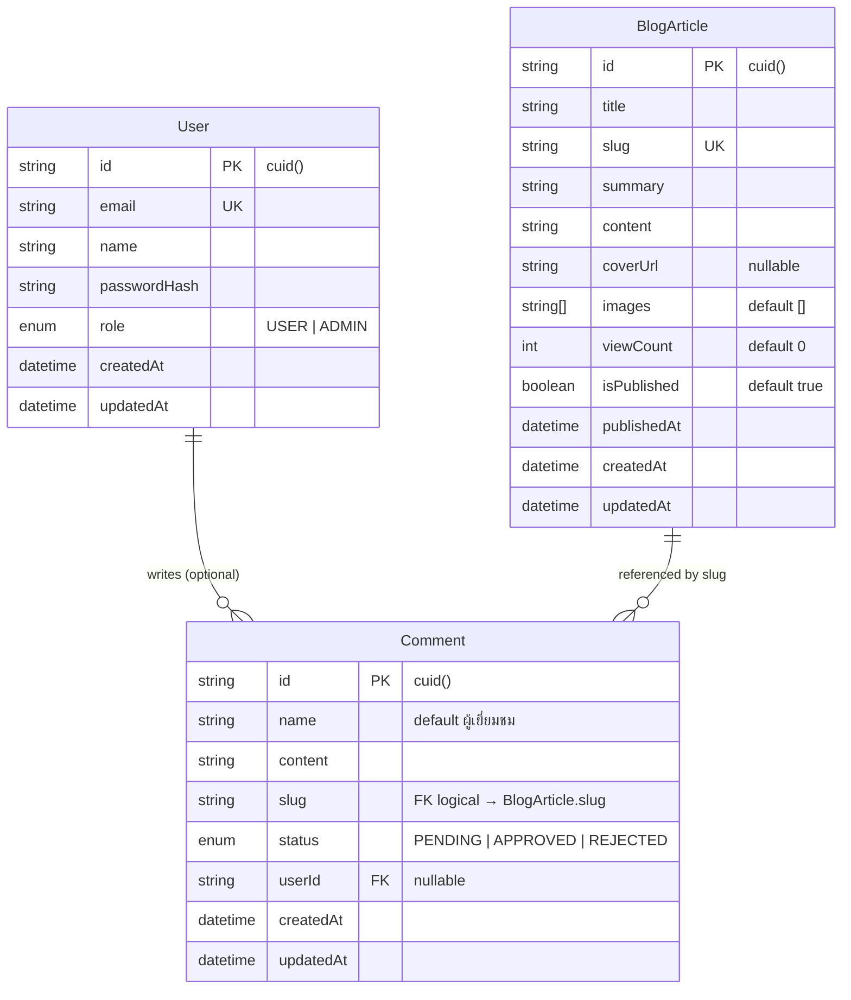

# Database Schema

> Aurora Blog — โครงสร้างฐานข้อมูล PostgreSQL ผ่าน Prisma ORM

## ER Diagram



## ตารางและฟิลด์

### `User`

| Column | Type | Constraints | คำอธิบาย |
|--------|------|-------------|----------|
| `id` | `String` | PK, `@default(cuid())` | รหัสผู้ใช้ |
| `email` | `String` | UNIQUE | อีเมลสำหรับ login |
| `name` | `String` | — | ชื่อที่แสดง |
| `passwordHash` | `String` | — | รหัสผ่านที่ hash แล้ว |
| `role` | `Role` | DEFAULT `USER` | บทบาท: `USER` หรือ `ADMIN` |
| `createdAt` | `DateTime` | auto | วันที่สร้าง |
| `updatedAt` | `DateTime` | auto | วันที่แก้ไขล่าสุด |

### `BlogArticle`

| Column | Type | Constraints | คำอธิบาย |
|--------|------|-------------|----------|
| `id` | `String` | PK, `@default(cuid())` | รหัสบทความ |
| `title` | `String` | INDEX | ชื่อบทความ (ใช้ค้นหา) |
| `slug` | `String` | UNIQUE | URL path เช่น `/blog/welcome` |
| `summary` | `String` | — | สรุปสั้น แสดงในหน้ารวม |
| `content` | `String` | — | เนื้อหาเต็ม |
| `coverUrl` | `String?` | — | URL ภาพปก |
| `images` | `String[]` | DEFAULT `[]` | แกลเลอรี่รูปในบทความ |
| `viewCount` | `Int` | DEFAULT `0` | จำนวนการเข้าชม |
| `isPublished` | `Boolean` | DEFAULT `true`, INDEX | สถานะเผยแพร่ |
| `publishedAt` | `DateTime` | INDEX | วันที่เผยแพร่ |
| `createdAt` | `DateTime` | auto | วันที่สร้าง |
| `updatedAt` | `DateTime` | auto | วันที่แก้ไขล่าสุด |

### `Comment`

| Column | Type | Constraints | คำอธิบาย |
|--------|------|-------------|----------|
| `id` | `String` | PK, `@default(cuid())` | รหัสคอมเมนต์ |
| `name` | `String` | DEFAULT `"ผู้เยี่ยมชม"` | ชื่อผู้ส่ง (guest) |
| `content` | `String` | — | ข้อความคอมเมนต์ |
| `slug` | `String` | INDEX `(slug, status)` | slug บทความที่อ้างอิง |
| `status` | `CommentStatus` | DEFAULT `PENDING` | สถานะ moderation |
| `userId` | `String?` | FK → User, INDEX | ผู้ใช้ที่ login (optional) |
| `createdAt` | `DateTime` | auto | วันที่ส่ง |
| `updatedAt` | `DateTime` | auto | วันที่แก้ไขล่าสุด |

## Enums

```prisma
enum Role {
  USER
  ADMIN
}

enum CommentStatus {
  PENDING    // รอผู้ดูแลอนุมัติ
  APPROVED   // แสดงใต้บทความ
  REJECTED   // ถูกปฏิเสธ
}
```

## การออกแบบที่สำคัญ

### 1. Comment อ้างอิง BlogArticle ผ่าน `slug` ไม่ใช่ FK ตรง

- **เหตุผล:** บทความถูก query บ่อยด้วย slug อยู่แล้ว (URL routing) และ comment ไม่จำเป็นต้อง cascade delete เมื่อลบบทความใน MVP
- **Trade-off:** ไม่มี referential integrity ระดับ DB — ตรวจสอบ slug มีอยู่จริงใน API layer ก่อน create comment

### 2. `userId` เป็น optional

- ผู้เยี่ยมชมส่งคอมเมนต์ได้โดยไม่ login (กรอกชื่อเอง)
- ถ้า login แล้วสามารถผูก `userId` ได้ในอนาคต

### 3. Index ที่เลือก

| Index | เหตุผล |
|-------|--------|
| `BlogArticle.title` | ค้นหาชื่อบทความ (`LIKE` / `contains`) |
| `BlogArticle.publishedAt` | เรียงล่าสุดก่อน |
| `BlogArticle.isPublished` | กรองเฉพาะที่เผยแพร่ |
| `Comment(slug, status)` | ดึงคอมเมนต์ที่อนุมัติแล้วต่อบทความ |
| `Comment.userId` | query คอมเมนต์ตามผู้ใช้ |

## ไฟล์อ้างอิง

- Schema: [`prisma/schema.prisma`](../prisma/schema.prisma)
- Seed data: [`prisma/seed.ts`](../prisma/seed.ts)
