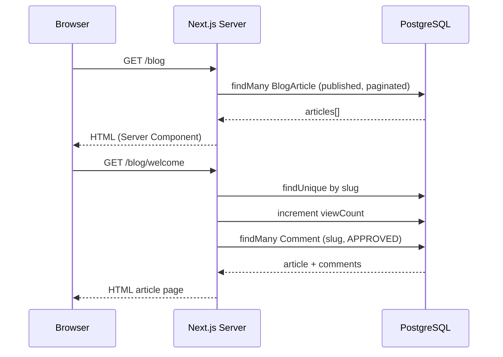
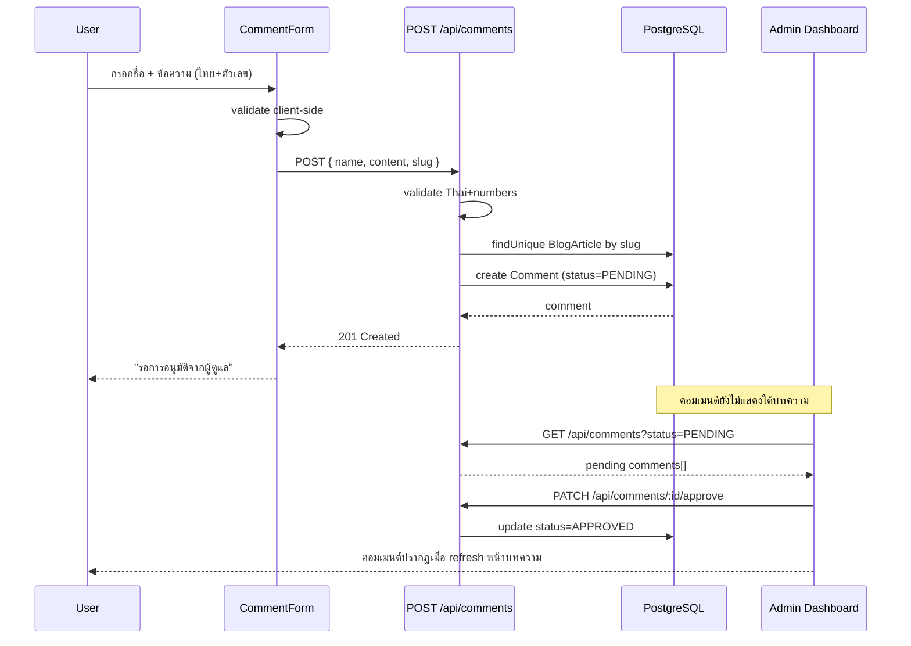
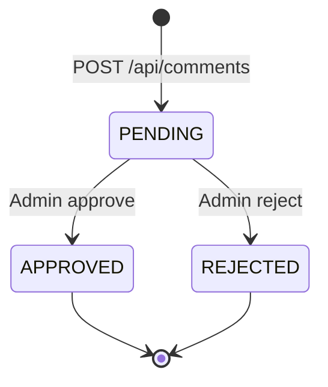
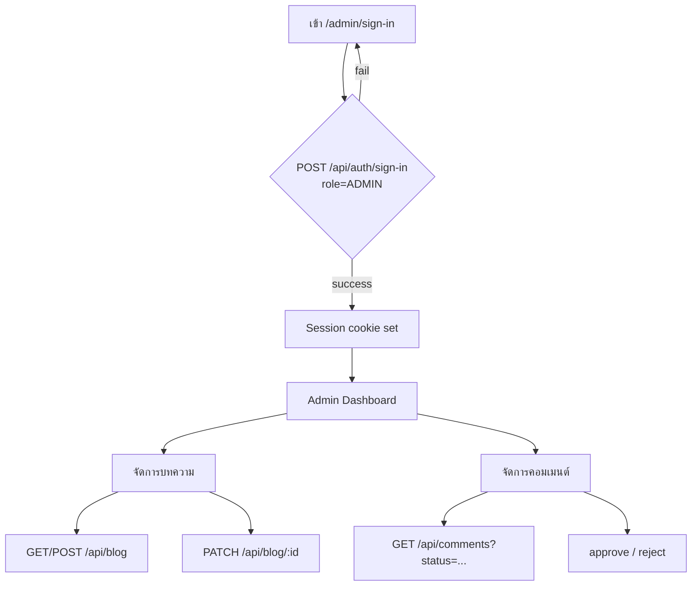
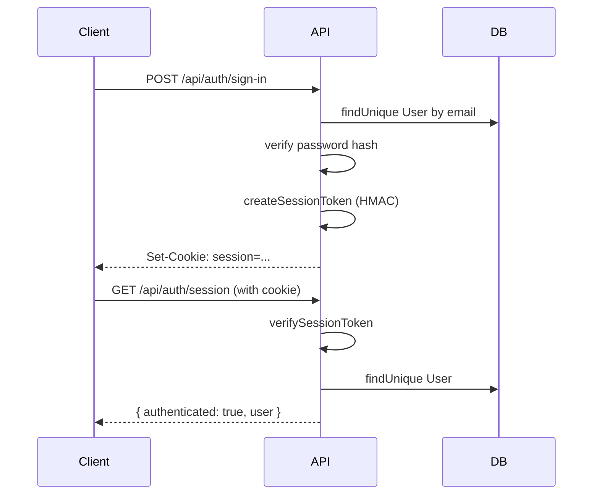
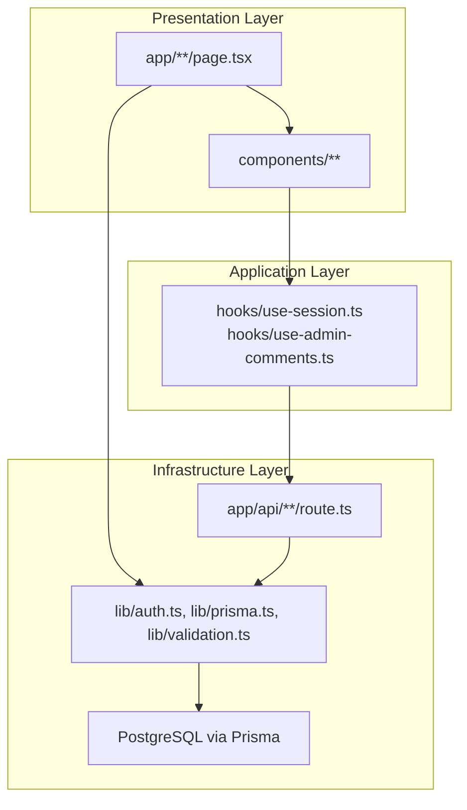

# Workflow — Flow การทำงาน

## 1. ผู้อ่านอ่านบทความ

**Search & Pagination**

- ค้นหา: `GET /blog?q=keyword&page=1`
- Server-side filter ด้วย Prisma `contains` บน `title`
- 10 บทความต่อหน้า

---

## 2. ผู้เยี่ยมชมส่งคอมเมนต์

**State machine ของ Comment:**

---

## 3. Admin จัดการระบบ

**Admin signup flow:**

1. ตั้ง `ADMIN_SIGNUP_CODE` ใน `.env`
2. ไป `/admin/sign-up` กรอก email, name, password, signup code
3. ระบบสร้าง User ด้วย `role = ADMIN` และ login อัตโนมัติ

---

## 4. Authentication Flow

---

## 5. สถาปัตยกรรมเลเยอร์ (Clean Architecture)

| Layer | หน้าที่ | ตัวอย่าง |
|-------|--------|---------|
| Presentation | UI + routing | `app/blog/page.tsx`, `components/blog/comment-form.tsx` |
| Application | Client state & orchestration | `useSession`, `useAdminComments` |
| Infrastructure | Business logic + data access | `lib/auth.ts`, `lib/blog-queries.ts`, Prisma |
